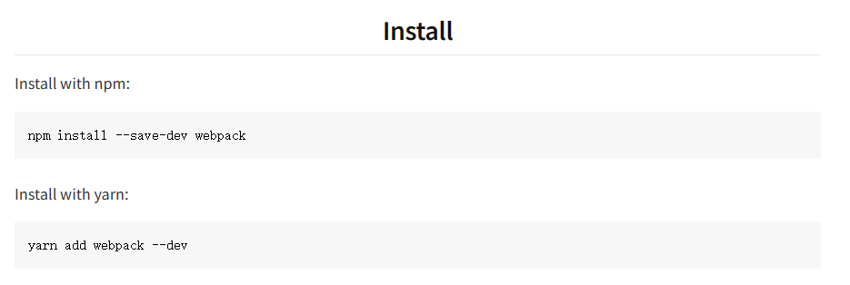

## 1 webpack 入门
1.1 装包 
官方网址https://www.npmjs.com/package/webpack
项目依赖 -S
项目开发工程依赖 -S - D

### 1.2 模式
**development 打包快，开发的时候，体积大
production 上线的时候，打包慢，体积小**

### 1.3 打包路径
4.x和5.x的版本中，如有默认约定
1. 默认打包入口src -> index.js
2. 默认输出的文件路径 dist -> main.js
可以在webpack.config.js中修改打包的默认约定
在entry属性中指定打包入口，output指定打包的出口

~~~javascript
entry:path.join(_dirname.'./src/index.js') // 打包入口路径
output:{
  path:path.join(_dirname.'./dist').  // 输出文件的路径
  filename:'bundle.js' //输出文件的名称
}
~~~

### 1.4 插件 html-webpack-plugin
https://juejin.cn/post/6844903853708541959
html-webpack-plugin的作用是：当使用webpack打包时，创建一个 html 文件，并把 webpack 打包后的静态文件自动插入到这个 html 文件当中。
**CIL中有这个插件，不需要配置**

### 1.5 webpack中的插件
在配置文件中，通过devServer节点对webpack-dev-server插件进行更多配置
更改配置必须重启项目

### 1.6 webpack中的loader
webpack只能打包js文件
css-loader可以打包处理.css文件
babel-loader可以处理webpack无法处理的高级JS语法

当webpack发现某个文件不能处理，就回去配置文件中的mode.rules节点找对应的数组，是否配置了对应的loader加载器，从后先前转交处理，直至发现没有loader，就把处理结构转交给webpack，把结果合并到/dist/bundle.js/，最终生成打包好的文件